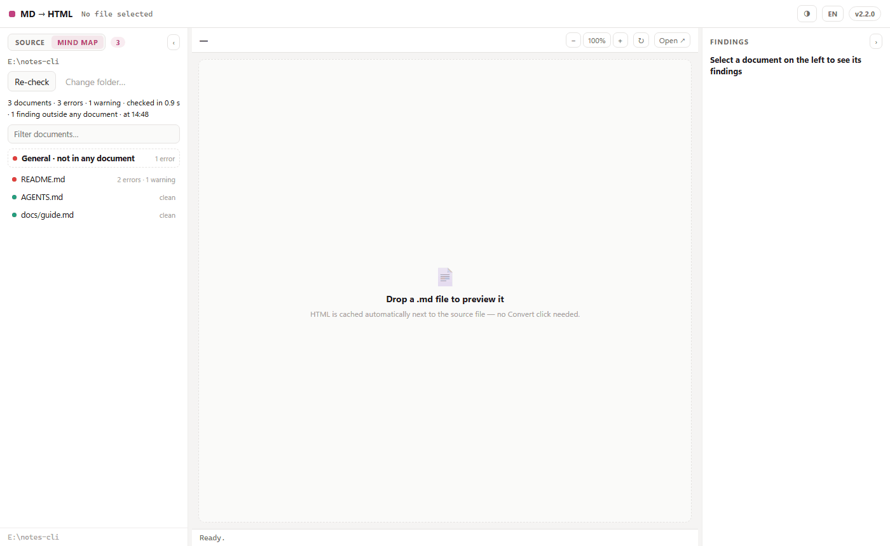

# Meinya Mind Map

**Your docs make claims about your code. Mind Map checks them, and shows the commit that broke each one.**

[Tiếng Việt](README.vi.md)

A README, an `AGENTS.md`, a `CLAUDE.md`, a guide: each names files, commands, options, functions and decisions. The code moves on and the doc keeps saying the old thing. A person loses an hour to it. A coding agent reads the stale line at the start of every session and acts on it.

Mind Map reads your Markdown, picks out every claim a machine can check, and checks it against the working tree and the git history. It uses no model and no network, and needs nothing but Python; git adds the history behind each finding.


## Try it

```bash
uv tool install git+https://github.com/Elainabaka/meinya-mind-map
cd your-repo
mindmap check .
```

`uv tool` (or `pipx install git+…`) puts `mindmap` on your PATH, which the hook and the agent setups below need. `pip install git+…` works too, inside the environment you install it into. Or without installing: clone this repo and run `python -I run_mindmap.py check /path/to/your-repo`.

This is what it prints for the demo repo in the picture:

<!-- mindmap: ignore-start -->
```text
README.md
  7:5  error  `scripts/setup.sh` no longer exists; it did when this line was written (2026-03-02)  [path-moved]
      ↳ 59c8e6d417 2026-03-02 · scripts/setup.sh · existed when the line was written
      ↳ b81c7e1cbb 2026-06-20 · tools/setup.sh · renamed
      → moved to `tools/setup.sh` in b81c7e1cbb (2026-06-20)
  11:1  warning  `--fast` was removed from `src/notes/cli.py` after this line was written (2026-03-02)  [flag-removed]
      ↳ 59c8e6d417 2026-03-02 · src/notes/cli.py
      ↳ c33a5ae744 2026-07-07 · src/notes/cli.py · removed by this commit: Drop --fast: the fast path is always on
  14:20  warning  no heading `#quick-start` in `docs/guide.md`  [anchor-missing]
      ↳ f740d7dfac 2026-08-15 · docs/guide.md · the heading `Quick start` was removed by this commit: Guide: rename the first section
  18:1  warning  `build_index()` is gone from the code; it existed when this line was written (2026-03-02)  [symbol-gone]
      ↳ 59c8e6d417 2026-03-02 · src/notes/cli.py:6 · `build_index` was here
      ↳ a3c7e3270a 2026-05-11 · src/notes/cli.py · removed by this commit: Rename build_index to rebuild_index
      → maybe renamed to `rebuild_index` (src/notes/cli.py)
  19:26  warning  decision D01 was replaced by D03; check this line still holds  [decision-superseded]
      ↳ DECISIONS.md:5

4 docs, 17 claims, 10 verified · 1 error, 6 warnings, 2 info · 0.8s
```
<!-- mindmap: ignore-end -->

For the page in the picture, add `--format html --out report.html`. It is one file and opens offline.

## How it decides

1. **Every finding carries its proof.** A file and line, or a commit id with its date and subject. You can check the checker.
2. **It reads history.** For each doc line it asks git when the line was written and what the repo held at that commit. "This file was here when you wrote the line, and commit `b81c7e1` moved it" is an error. "This name was never in the repo" is usually an example, another project or the reader's own file, so it stays quiet.
3. **No proof, no warning.** Plans, changelogs, decision logs and dated posts describe another time on purpose; they are read with looser rules. Findings come in three levels and the lowest one, notes, is hidden unless you ask.
4. **It only reads.** It never edits a doc or a file of code, never runs code from the repo it checks, and never opens files that usually hold secrets.

## What it checks

| A doc says | Checked against | Finding ids |
|---|---|---|
| a path, in backticks or as a link | the files in the tree, and every move and delete in history | `path-moved`, `path-gone`, `path-removed-now`, `path-typo`, `path-missing`, `link-broken`, `link-case` |
| a path that is not in the tree and never was (agents make these up) | the first folder of the path, which must exist; files the build makes or git ignores are skipped | `path-missing`: a warning in CLAUDE.md, AGENTS.md and the like, a note elsewhere |
| a link to a heading, `guide.md#install` | the headings and ids of that page, and the commit that removed one | `anchor-missing` |
| a command in a code block | script files, `package.json` scripts, Makefile targets | `command-missing`, `npm-script-missing`, `make-target-missing` |
| an option or subcommand of a script in the repo | the source of that script, then and now | `flag-removed`, `flag-missing`, `subcommand-missing` |
| a function, class or constant | an index of the names the code defines, and history | `symbol-gone`, `symbol-removed-now` |
| a decision id such as `D01` or `ADR-7` | the decision log or ADR folder: unknown, replaced, partly replaced | `decision-unknown`, `decision-superseded`, `decision-amended` |
| a version or a pinned dependency | the package files | `version-mismatch`, `dep-mismatch` |
| the same sentence in two docs, with different numbers | each other | `copies-diverged` |
| a rule, with a pattern beside it (see below) | the code | `rule-violation` |
| a table | its own shape | `table-shape`, `table-orphan` |

Notes, shown with `--severity info`: `stale-risk` (the code a doc describes changed after the doc), `link-unverified` and `anchor-unverified` (an address only the built site can confirm), `foreign-links` (a doc copied in from another project).

### A rule in words that the machine enforces

Put a pattern under the sentence that states the rule. The doc stays readable, and the rule stops being a wish:

<!-- mindmap: ignore-start -->
```markdown
Never call `os.kill(pid, 0)`: on Windows it sends Ctrl+C to the whole console.
<!-- mindmap: forbid /os\.kill\([^,]+,\s*0\)/ in **/*.py -->
```

```text
src/app/watch.py
  5:1  error  breaks the rule in AGENTS.md:4: "Never call os.kill(pid, 0): on Windows it sends Ctrl+C to the whole console."  [rule-violation]
```
<!-- mindmap: ignore-end -->

## For coding agents

An agent trusts its instruction files. Mind Map gives it three ways to stop trusting stale ones.

**A hook for Claude Code.** Right after the agent edits code, the hook tells it which doc lines still mention what the edit removed. Add this to `.claude/settings.json` yourself; Mind Map never installs it.

```json
{
  "hooks": {
    "PostToolUse": [{"matcher": "Edit|Write|MultiEdit",
                     "hooks": [{"type": "command", "command": "mindmap hook", "timeout": 30}]}],
    "SessionStart": [{"hooks": [{"type": "command", "command": "mindmap hook", "timeout": 30}]}]
  }
}
```

What the agent then sees after it renames a function, and what it sees when a session starts:

<!-- mindmap: ignore-start -->
```text
Mind Map: your change to src/notes/cli.py removed things that docs still mention. Update these lines (or say why not):
- AGENTS.md:4 `load_config` (name) was removed from `src/notes/cli.py` and no code has it any more
- README.md:18 `load_config` (name) was removed from `src/notes/cli.py` and no code has it any more
```

```text
Mind Map: 3 line(s) in the instruction files you just read are out of date; trust the code over them:
- AGENTS.md:3 `build_index()` is gone from the code; it existed when this line was written (2026-03-02) (maybe renamed to `rebuild_index` (src/notes/cli.py))
- AGENTS.md:4 `load_config()` is gone from the code; it existed when this line was written (2026-03-02)
- AGENTS.md:6 decision D01 was replaced by D03; check this line still holds
Each finding is machine evidence, not a verdict: read the doc line in its context first. If it describes another project's tool, an example, a hypothetical or a past plan, the line may be right: say so instead of editing it.
```
<!-- mindmap: ignore-end -->

The hook never blocks an edit and always exits 0. If it cannot check, it says so in one line, so no message means nothing was found. It works from the project root Claude Code gives hooks (`CLAUDE_PROJECT_DIR`), not from the folder the agent last moved into.

**An MCP server.** `mindmap mcp` speaks the Model Context Protocol on stdio, in both the 2024 to 2025 form (`initialize`) and the 2026-07-28 form (`server/discover`). It is read-only.

```bash
claude mcp add mind-map -- mindmap mcp
```

| Tool | What the agent gets |
|---|---|
| `check` | doc lines that disagree with the code or the history, with proof |
| `impact` | after a code change: doc lines that still mention what the change removed |
| `claims` | every checkable claim in one doc and whether it holds |
| `context` | the doc sections that matter for a task, inside a token budget, stale lines marked |
| `cost` | tokens of the instruction files loaded every session, and how many of their lines are stale |

Three prompts come with it: `fix-drift` (fix what `check` found), `prose-to-rules` (propose `forbid` lines for rules written in words), `critic` (a blunt review of whether the project should exist).

**Codex, Cursor, VS Code.** All three read `AGENTS.md`, so Mind Map checks the same file your agent reads. Add the same MCP server:

```bash
codex mcp add mind-map -- mindmap mcp     # Codex CLI; or [mcp_servers.mind-map] in ~/.codex/config.toml
```

Cursor, in `.cursor/mcp.json` (or `~/.cursor/mcp.json` for every project):

```json
{"mcpServers": {"mind-map": {"type": "stdio", "command": "mindmap", "args": ["mcp"]}}}
```

VS Code with Copilot, in `.vscode/mcp.json` (the key is `servers`; the server starts once you trust the workspace):

```json
{"servers": {"mind-map": {"type": "stdio", "command": "mindmap", "args": ["mcp"]}}}
```

If the editor cannot find `mindmap`, give the full path of the installed command (`mindmap.exe` on Windows). Docs: [Codex MCP](https://learn.chatgpt.com/docs/extend/mcp?surface=cli), [Cursor MCP](https://cursor.com/docs/context/mcp), [VS Code MCP](https://code.visualstudio.com/docs/copilot/customization/mcp-servers).

**The same from a terminal.**

<!-- mindmap: ignore-start -->
```text
$ mindmap impact
AGENTS.md:4  `load_config` (name) was removed from `src/notes/cli.py` and no code has it any more
README.md:18  `load_config` (name) was removed from `src/notes/cli.py` and no code has it any more

$ mindmap cost .
 tokens  stale  file  (loaded)
     76      3  AGENTS.md  (every session)
~76 tokens are read at the start of every session; 3 stale lines in total.

$ mindmap context "change how the index is stored" --budget 400
## README.md:16-20 · How it works
## How it works

`build_index()` scans the folder once and `load_config()` reads `notes.toml`.
  [stale] `build_index()` is gone from the code; it existed when this line was written (2026-03-02)
  [stale] `load_config()` is gone from the code; it existed when this line was written (2026-03-02)
The index format follows D01. Search is case-insensitive (D02).
  [stale] decision D01 was replaced by D03; check this line still holds
...
{"tokens": 270, "sections": 6}
```
<!-- mindmap: ignore-end -->

## In CI

A GitHub Action that writes a summary on the run page and marks the lines in the pull request:

```yaml
jobs:
  docs:
    runs-on: ubuntu-latest
    steps:
      - uses: actions/checkout@v4
        with:
          fetch-depth: 0    # the whole history: Mind Map reads it
      - uses: Elainabaka/meinya-mind-map@v0.1.0
        with:
          fail-on: error
```

As a pre-commit hook:

```yaml
repos:
  - repo: https://github.com/Elainabaka/meinya-mind-map
    rev: v0.1.0
    hooks:
      - id: mindmap
```

For code scanning, `mindmap check . --format sarif --out mindmap.sarif`. Other formats: `json`, `github`, `md`.

## Fitting it to a repo

| Need | How |
|---|---|
| Start on an old repo without fixing everything first | `mindmap check . --update-baseline` records today's findings in `.mindmap-baseline.json`; from then on `--baseline .mindmap-baseline.json` shows only new ones |
| Show more, or fail earlier | `--severity info` shows notes; `--fail-on warning` makes warnings fail the run |
| Skip a folder | `--exclude "vendor/**"`, or `exclude = ["vendor/**"]` in `.mindmap.toml` |
| Silence one line, a block or a file | `<!-- mindmap: ignore -->` at the end of the line, `ignore-start` and `ignore-end` around a block, `ignore-file` anywhere in the doc |
| Tell it how to read a doc | `live`, `plans`, `history` lists of globs in `.mindmap.toml` (or under `[tool.mindmap]` in `pyproject.toml`), or `<!-- mindmap: history -->` (or `plan`, `live`) anywhere in the doc, which wins over both. A history doc (an old prompt, a pasted chat) keeps only its decision ids checked |
| Messages in Vietnamese | `--lang vi`, or `lang = "vi"` in the config |

## Measured, not promised

Twelve public repos, each at the commit named, each with its full history. Seconds are for the first run on a repo (measured with 0.1.0), the one that builds the code index: on Windows 11, then on Ubuntu under WSL on the same desktop PC. A later run reuses the index while no code file changes (vite: 4.1 s on Windows, 3.4 s on Linux).

| Repo at commit | Commits read | Docs | Claims | Errors | Warnings | Notes | Seconds |
|---|---|---|---|---|---|---|---|
| modelcontextprotocol/python-sdk `91941ed` | 1,093 | 771 | 31,926 | 0 | 0 | 482 | 11.6 / 5.6 |
| gohugoio/hugoDocs `1f72674` | 15,484 | 1,013 | 6,929 | 1 | 1 | 627 | 16.3 / 8.5 |
| withastro/starlight `531af7d` | 3,805 | 385 | 5,085 | 0 | 0 | 234 | 7.0 / 3.4 |
| anthropics/anthropic-sdk-python `50b78d1` | 1,516 | 16 | 2,497 | 0 | 0 | 5 | 5.0 / 2.2 |
| vitejs/vite `b6c20f6` | 9,760 | 84 | 1,706 | 0 | 18 | 53 | 8.8 / 4.7 |
| fastapi/typer `b15210b` | 1,781 | 80 | 561 | 2 | 0 | 6 | 2.8 / 0.9 |
| encode/starlette `0a15da3` | 1,764 | 33 | 555 | 0 | 0 | 20 | 1.3 / 0.4 |
| tj/commander.js `ba6d13d` | 1,517 | 15 | 340 | 0 | 0 | 4 | 1.5 / 0.4 |
| junegunn/fzf `33a3456` | 3,749 | 9 | 278 | 0 | 0 | 3 | 1.3 / 0.5 |
| encode/httpx `b5addb6` | 1,523 | 29 | 232 | 0 | 3 | 11 | 1.6 / 0.4 |
| BurntSushi/ripgrep `3fce3b5` | 2,287 | 23 | 167 | 0 | 0 | 12 | 1.2 / 0.5 |
| expressjs/express `9efc29e` | 6,177 | 4 | 47 | 0 | 0 | 1 | 1.0 / 0.3 |

That is 2,462 docs and 50,323 claims. 25 findings came out as errors or warnings, and each was read by hand: 24 are real, 1 is a false alarm.

- **vite, 18 real.** The posts that announced Vite 5 and Vite 6 link to sections of the migration guide. Later rewrites of the guide removed those sections. Each warning names the commit that did it.
- **httpx, 3 real.** Links to headings that have since been renamed.
- **typer, 2 real.** The README links to `tutorial/install.md`, which only resolves from inside `docs/`.
- **hugoDocs, 1 real.** `AGENTS.md` tells coding agents to edit `layouts/_partials/icons.html`, which is not in the repo. Found by `path-missing`, the rule added after the first round of measurements.
- **hugoDocs, 1 false alarm.** A page tells readers to put a `package.hugo.json` in their own module. The docs repo had a file by that name when the line was written, and deleted it later. Every piece of the proof is true; the line was simply about someone else's file.

A second experiment: rename one class in starlette (`CORSMiddleware` to `CorsMiddleware`) and run again. Two warnings appear, on the two doc lines that still use the old name, each with the commit and the new name as a suggestion.

**The first runs were not this clean.** The Python SDK of MCP gave 435 false alarms the first time. Three documentation sites gave 294 findings, about 20 of them real. Five repos it had never seen gave 9 findings: 2 real, 6 false, 1 arguable. Reading the full history of hugoDocs and vite, where the first clones were shallow, added 20 findings, every one of them false. Every false alarm was traced to a general gap (39 so far: addresses written for a built site, the many ways sites name a heading, a history with two lines of commits side by side, and so on) and closed with a test. No repo has a rule of its own. Expect a few false alarms on a repo shaped unlike these twelve; the baseline and the ignore comments are there for that.

**Twenty more repos it had never met (October 9).** Same method, in three rounds, every error and warning read by hand. Round 1, nine repos (cobra, task, cli/cli, bat, mdBook, execa, black, poetry, vuejs/docs): 81 findings, 2 real, 79 false. Round 2, six repos (prettier, urfave/cli, pipx, yargs, clap, vitepress): 44 findings, 2 real, 42 false. Each of those false alarms was traced to a general gap and closed with a test (15 more), and the twelve repos above kept every finding. Round 3, five repos measured after the fixes (fd, glow, uvicorn, got, pnpm.io): 48 findings, 14 real, 34 false. got gave 9, all real: a link to a page that never existed and 8 links to headings that are gone. 32 of the false alarms came from pnpm.io, a docs site kept apart from the code of the tool it describes, so the settings and config files its pages name belong to pnpm, not to the site. The goal for 1.0, at most one false alarm in ten on a first run, is not met yet.

**Fourteen small repos built with coding agents (October 9).** This is the kind of repo 1.0 is for. Each has a CLAUDE.md or AGENTS.md and 86 to 913 commits: 3 in Python, 4 in TypeScript, 3 in Go, 4 in Rust. Version 0.1.0 gave 91 errors and warnings: 31 real, 54 false, 6 arguable. Six of the fourteen gave none, and 53 of the 54 false alarms came from three repos (design specs named by date and already done, local variables read as definitions, the folder that `git clone` makes, links to GitHub's own pages). After the fixes: 44, of which 28 are real, 10 false, 6 arguable. Three real ones became notes on the way: two names of local variables, one link inside a dated design spec. These numbers come from the same fourteen repos the fixes were drawn from, so they flatter the tool; a set it has never seen is next. A second look at those 10 (October 9, evening) found that 8 did not need a reader after all: the code builds the device IDs from a format string (`f"time_{n}_{field}"`), and each was reported twice because the table names it in two columns. Now: 36, of which 28 are real, 2 false, 6 arguable.

**Eleven more repos built with coding agents, never seen before (October 9, evening).** Picked by Haiku 5.5 with the same rules: 2 in Python, 3 in TypeScript, 2 in Go, 2 in Rust, 1 in Java, 1 in C++, all with an AGENTS.md or CLAUDE.md. The first run was bad: 81 errors and warnings, 36 real, 43 false, 2 arguable. 31 of the 43 came from one repo's pending release notes (`.changeset/*.md`, which the tool did not yet read as a changelog); the others were a file tree whose top folders sit at the left edge, a library's package path (`pkg/bindings` of an import), `bun run --parallel "*:check"` and `bun run index.ts` read as script names, and one link inside a sample of rendered output. After fixing the general causes: 38, of which 36 are real (none lost), 1 false, 1 arguable. Again measured on the set the fixes came from, so the next unseen set is the real test.

**Thirteen more, never seen before (October 9, night).** Picked the same way: 3 in Python, 2 in Go, 2 in Rust, 2 in TypeScript, 1 each in JavaScript, Dart and Kotlin. The first run still missed the bar: 62 errors and warnings, 35 real, 27 false. 15 of the 27 came from one file tree drawn from the folder that holds the clone (`ocmonitor/ocmonitor/cli.py`, read from the wrong root); without it, 12 false out of 47. The others: names from an SDK that moved to its own repo and is now installed from there, build folders a `.gitignore` names (`/src/generated/prisma`), file names that are string keys of a project template, a dated experiment record (`**Date**: 2026-07-11` under its title), a requirement read as our version (`OpenCode v1.2.0+`), and a Makefile target defined in another Makefile (left as is: a real finding of the same kind sits in another Makefile too). After the fixes: 37, of which 35 are real (none lost), 2 false. Rerun on every older set, the fixes lost no real finding and turned up 12 real ones the tool had missed, all in trees drawn from the repo's own folder (`holy-grail/` on top, then `claude/agents/`, deleted in January). One bug found on the way: a long base64 string in code made the main branch of the evening before (not 0.1.0) run out of memory on a big workspace; strings over 400 characters are no longer read as paths.

**Does an agent need a separate AI judge?** The same 81 findings were handed to a small model (Haiku 5.5) acting as the user's coding agent, with the repo at hand and without the labels, as "fix the stale docs". It left alone 42 of the 43 false alarms and edited one correct line; with the note now printed under every list of findings (shown above), it left all 43 alone and fixed 30 of the 36 real ones (the other 6 it raised with the user: a tutorial to rewrite, a recipe missing from the code side). So Mind Map adds no AI step of its own: an agent that reads the line already understands it.

**Same input, same report.** The JSON report for all twelve repos is identical on Windows (a machine set to UTC+7) and on Linux (UTC), down to each message and each date, and does not change with Python's hash seed.

## Limits

- It reads Markdown (`.md`, `.markdown`, `.mdx`), not reStructuredText or AsciiDoc.
- It checks what a machine can prove. Whether a paragraph still describes the behaviour well is a judgement it leaves to you; `stale-risk` only points at where to look.
- Docs of a product that talk about the reader's project can name a file the repo itself once had. That is the false alarm above.
- A site generator makes pages and ids that are not in the repo. Mind Map follows the common conventions and turns the rest into notes, not warnings.
- Names in code are found with a text index and patterns for definitions in more than thirty languages, not with a parser for each. A definition written in an unusual way is missed, and then Mind Map stays quiet.
- A shallow clone has less history, so it gives fewer findings (never more). In CI, fetch the full history.
- If git does not answer in time (each call has a hard time limit, and after three timeouts in one run it stops asking), the report says how many questions went unanswered: a `!` line, `stats.git_unanswered` in JSON, a line on stderr. Such a report may miss findings: run it again. The exit code still follows the findings only.
- Status: 0.1.0, alpha. It needs Python 3.11 or newer; git adds the history, but a repo without it is still checked. Tested on Windows: 455 tests on Python 3.13, 356 of them for Mind Map; on Python 3.11 the Mind Map tests pass too (one is skipped: it needs 3.12). Linux (Python 3.14) was last tested with 0.1.0. Not tested yet: macOS.

## Safety

- It writes only what you ask for (`--out`, `--update-baseline`) and one cache file of the code index in your user cache folder. `MINDMAP_CACHE_DIR` moves the cache.
- No network, no model, no telemetry.
- It never runs or imports code from the repo it checks. It reads text and asks git.
- It skips files that usually hold secrets: `.env` files, `.npmrc`, `.pypirc`, `.netrc`, SSH keys, `*.pem`, `*.key`, cookie files, and any path with `secret` in it.
- On a repo you do not trust, use the installed `mindmap` command or `python -I run_mindmap.py`. Do not run `python -m mindmap` from inside that repo: Python would put the repo's folder first on its import path.

## Also in this repo: Meinya MD to HTML

Mind Map grew out of a small tool that turns Markdown into a single HTML page you can open offline, and that tool still lives here.


- **Command line**, standard library only: `python md_to_html.py NOTES.md` writes `NOTES.html` next to it; give it a folder to convert every file in it. Table of contents, light and dark mode, copy buttons on code, GitHub-style tables and callouts.
- **Desktop app for Windows 10 and 11**: double-click `run.bat`. The first run creates `.venv` and installs the pinned `pywebview` 6.2.1 (about 3 MB, needs the Edge WebView2 runtime). Drop a `.md` file on the window.
- **Mind Map in the app**: the Mind Map tab checks a folder and lists its docs with a dot for the worst finding in each. Pick one to read it next to its findings and their proof; ↑ and ↓ move through the list. English or Vietnamese.


- Not supported: footnotes, Mermaid, KaTeX, syntax colouring by language. It escapes Markdown content, but it is not a filter for content you do not trust.

Details, the full option list and the licences of the libraries `run.bat` installs are in the [Vietnamese README](README.vi.md).

## Tests

```bash
python -m pip install pytest
python -m pytest tests -q
```

The two test files of the desktop window are skipped when `pywebview` is not installed. Everything else runs anywhere.

## Licence

The code is under the MIT licence; see the `LICENSE` file. The name Meinya, the character art and the name Elainabaka are not part of that licence.

Made by [Elainabaka](https://elainabaka.com).
