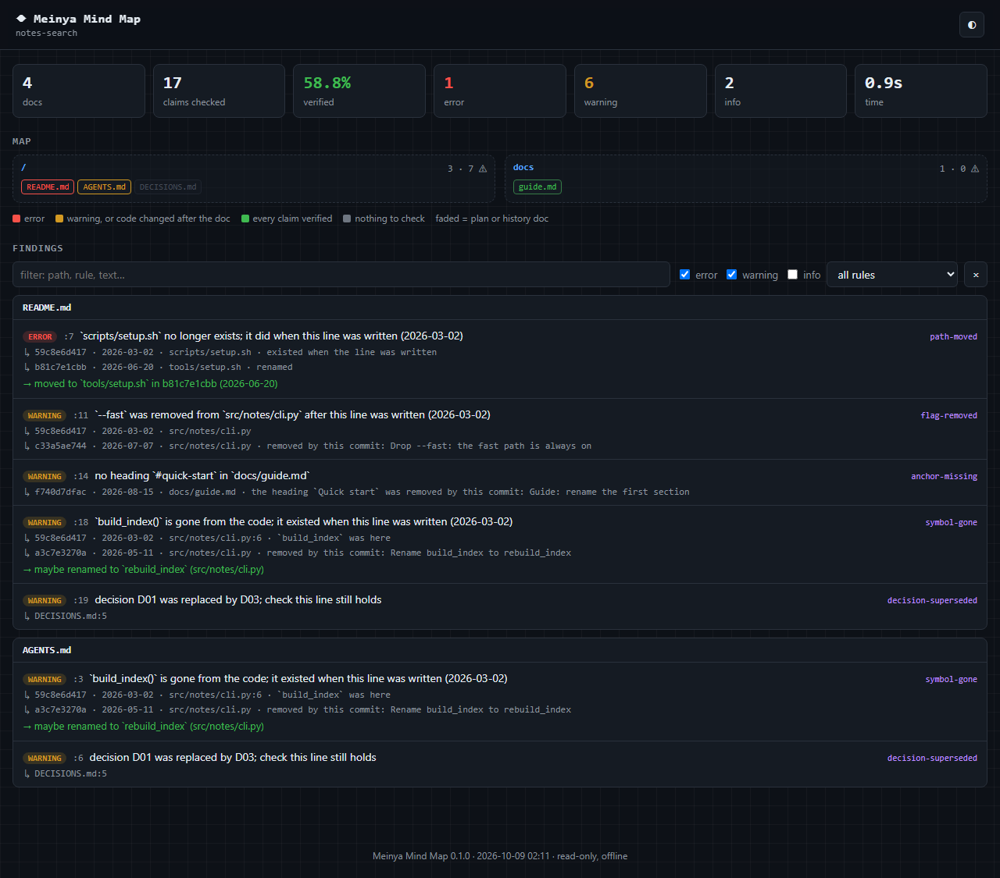
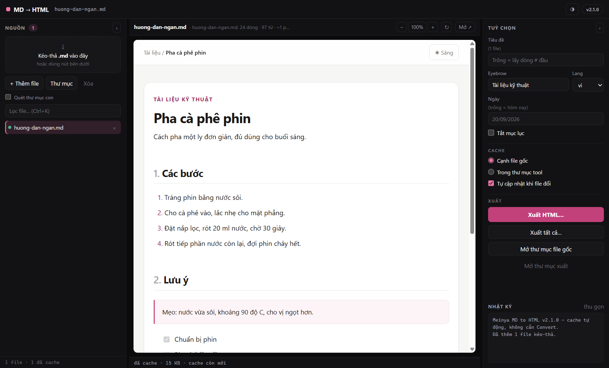
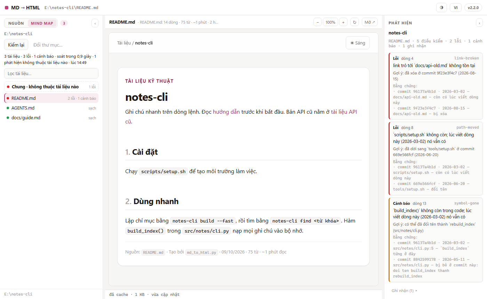

# Meinya Mind Map

**Tài liệu của bạn nói nhiều điều về code. Mind Map kiểm từng điều, và chỉ ra commit đã làm nó sai.**

[English](README.md)

README, `AGENTS.md`, `CLAUDE.md`, bài hướng dẫn: file nào cũng nhắc tên file, lệnh, tùy chọn, hàm và các quyết định. Code đổi tiếp, còn tài liệu vẫn nói điều cũ. Người đọc mất một giờ vì nó. Agent viết code thì đọc dòng cũ đó vào đầu mỗi phiên và làm theo.

Mind Map đọc Markdown của bạn, nhặt ra mọi điều mà máy kiểm được, rồi đối chiếu với thư mục hiện tại và lịch sử git. Nó không dùng model, không dùng mạng, và chỉ cần Python; có git thì mỗi phát hiện kèm thêm bằng chứng từ lịch sử.



## Dùng thử

```bash
uv tool install git+https://github.com/Elainabaka/meinya-mind-map
cd repo-cua-ban
mindmap check . --lang vi
```

`uv tool` (hoặc `pipx install git+…`) đặt lệnh `mindmap` vào PATH, thứ mà hook và phần cài cho agent bên dưới cần. `pip install git+…` cũng được, nhưng lệnh chỉ có trong môi trường bạn cài vào. Không muốn cài: tải repo này về rồi chạy `python -I run_mindmap.py check /duong/dan/toi/repo --lang vi`.

Đây là kết quả với repo mẫu trong ảnh:

<!-- mindmap: ignore-start -->
```text
README.md
  7:5  lỗi  `scripts/setup.sh` không còn; lúc viết dòng này (2026-03-02) nó vẫn có  [path-moved]
      ↳ 59c8e6d417 2026-03-02 · scripts/setup.sh · còn có lúc viết dòng này
      ↳ b81c7e1cbb 2026-06-20 · tools/setup.sh · đổi tên
      → đã dời sang `tools/setup.sh` ở commit b81c7e1cbb (2026-06-20)
  11:1  cảnh báo  `src/notes/cli.py` đã bỏ cờ `--fast` sau khi dòng này được viết (2026-03-02)  [flag-removed]
      ↳ 59c8e6d417 2026-03-02 · src/notes/cli.py
      ↳ c33a5ae744 2026-07-07 · src/notes/cli.py · bị bỏ ở commit này: Drop --fast: the fast path is always on
  14:20  cảnh báo  `docs/guide.md` không có mục `#quick-start`  [anchor-missing]
      ↳ f740d7dfac 2026-08-15 · docs/guide.md · mục `Quick start` bị bỏ ở commit này: Guide: rename the first section
  18:1  cảnh báo  `build_index()` không còn trong code; lúc viết dòng này (2026-03-02) nó vẫn có  [symbol-gone]
      ↳ 59c8e6d417 2026-03-02 · src/notes/cli.py:6 · `build_index` từng ở đây
      ↳ a3c7e3270a 2026-05-11 · src/notes/cli.py · bị bỏ ở commit này: Rename build_index to rebuild_index
      → có thể đã đổi tên thành `rebuild_index` (src/notes/cli.py)
  19:26  cảnh báo  quyết định D01 đã bị thay bởi D03; xem dòng này còn đúng không  [decision-superseded]
      ↳ DECISIONS.md:5
```
<!-- mindmap: ignore-end -->

Muốn có trang như trong ảnh, thêm `--format html --out report.html`. Trang là một file duy nhất, mở được khi không có mạng.

## Nó quyết định thế nào

1. **Phát hiện nào cũng kèm bằng chứng.** Một file và số dòng, hoặc mã commit kèm ngày và tiêu đề. Bạn kiểm lại được chính công cụ kiểm.
2. **Nó đọc lịch sử.** Với mỗi dòng tài liệu, nó hỏi git dòng đó được viết lúc nào và ở commit đó repo có gì. "File này còn đó lúc bạn viết dòng này, và commit `b81c7e1` đã dời nó đi" là lỗi. "Tên này chưa từng có trong repo" thì thường là ví dụ, dự án khác hoặc file của chính người đọc, nên nó im lặng.
3. **Không có bằng chứng thì không cảnh báo.** Kế hoạch, nhật ký thay đổi, sổ quyết định và bài viết có ngày tháng cố ý kể về một thời điểm khác, nên được đọc với luật lỏng hơn. Phát hiện có ba mức, mức thấp nhất (ghi chú) chỉ hiện khi bạn yêu cầu.
4. **Nó chỉ đọc.** Nó không sửa tài liệu hay code, không chạy code của repo đang kiểm, và không mở những file thường chứa bí mật.

## Nó kiểm những gì

| Tài liệu nói | Đối chiếu với | Mã phát hiện |
|---|---|---|
| một đường dẫn, trong dấu backtick hoặc trong link | các file đang có, và mọi lần dời, xóa trong lịch sử | `path-moved`, `path-gone`, `path-removed-now`, `path-typo`, `path-missing`, `link-broken`, `link-case` |
| một đường dẫn không có trong cây và chưa từng có (agent hay bịa kiểu này) | thư mục đầu của đường dẫn phải có thật; bỏ qua file do bước build sinh ra hay git bỏ qua | `path-missing`: cảnh báo trong CLAUDE.md, AGENTS.md và các file cùng loại, ghi nhận ở nơi khác |
| link tới một mục, `guide.md#install` | các mục và mã neo của trang đó, cùng commit đã bỏ mục | `anchor-missing` |
| một lệnh trong khối code | file script, script trong `package.json`, target của Makefile | `command-missing`, `npm-script-missing`, `make-target-missing` |
| tùy chọn hoặc lệnh con của một script trong repo | mã nguồn của script đó, lúc trước và bây giờ | `flag-removed`, `flag-missing`, `subcommand-missing` |
| tên hàm, lớp, hằng số | chỉ mục các tên mà code định nghĩa, và lịch sử | `symbol-gone`, `symbol-removed-now` |
| mã quyết định như `D01`, `ADR-7` | sổ quyết định hoặc thư mục ADR: không có, đã bị thay, bị thay một phần | `decision-unknown`, `decision-superseded`, `decision-amended` |
| phiên bản, hoặc thư viện ghim phiên bản | các file khai báo gói | `version-mismatch`, `dep-mismatch` |
| cùng một câu ở hai tài liệu nhưng khác số | đối chiếu lẫn nhau | `copies-diverged` |
| một luật, có mẫu kiểm đặt ngay bên dưới (xem dưới) | code | `rule-violation` |
| một bảng | hình dạng của chính nó | `table-shape`, `table-orphan` |

Ghi chú, hiện khi thêm `--severity info`: `stale-risk` (code mà tài liệu mô tả đã đổi sau tài liệu), `link-unverified` và `anchor-unverified` (địa chỉ chỉ site đã dựng mới xác nhận được), `foreign-links` (tài liệu chép từ dự án khác sang).

### Luật viết bằng lời mà máy giữ hộ

Đặt một mẫu kiểm ngay dưới câu nêu luật. Tài liệu vẫn dễ đọc, và luật thôi là lời nhắc suông:

<!-- mindmap: ignore-start -->
```markdown
Cấm gọi `os.kill(pid, 0)`: trên Windows nó bắn Ctrl+C vào cả console.
<!-- mindmap: forbid /os\.kill\([^,]+,\s*0\)/ in **/*.py -->
```
<!-- mindmap: ignore-end -->

File code nào vi phạm sẽ bị báo lỗi `rule-violation`, kèm nguyên văn câu luật và chỗ nó được viết.

## Dành cho agent viết code

Agent tin các file chỉ dẫn của nó. Mind Map cho nó ba cách để thôi tin những dòng đã cũ.

**Hook cho Claude Code.** Ngay sau khi agent sửa code, hook báo cho nó những dòng tài liệu còn nhắc thứ vừa bị bỏ. Bạn tự thêm đoạn này vào `.claude/settings.json`; Mind Map không bao giờ tự cài.

```json
{
  "hooks": {
    "PostToolUse": [{"matcher": "Edit|Write|MultiEdit",
                     "hooks": [{"type": "command", "command": "mindmap hook", "timeout": 30}]}],
    "SessionStart": [{"hooks": [{"type": "command", "command": "mindmap hook", "timeout": 30}]}]
  }
}
```

Hook không bao giờ chặn một lần sửa và luôn thoát với mã 0. Không soát được thì nó nói một dòng, nên không có báo cáo nghĩa là không tìm thấy gì. Nó lấy gốc dự án Claude Code đưa cho hook (`CLAUDE_PROJECT_DIR`), không theo thư mục agent vừa `cd` vào.

**MCP server.** `mindmap mcp` nói giao thức Model Context Protocol qua stdio, cả dạng 2024–2025 (`initialize`) lẫn dạng 2026-07-28 (`server/discover`). Server chỉ đọc.

```bash
claude mcp add mind-map -- mindmap mcp
```

| Công cụ | Agent nhận được |
|---|---|
| `check` | các dòng tài liệu trái với code hoặc lịch sử, kèm bằng chứng |
| `impact` | sau khi sửa code: các dòng tài liệu còn nhắc thứ vừa bị bỏ |
| `claims` | mọi điều kiểm được trong một tài liệu, và nó còn đúng không |
| `context` | các mục tài liệu liên quan tới một việc, gói trong ngân sách token, dòng cũ được đánh dấu |
| `cost` | số token của các file chỉ dẫn được nạp mỗi phiên, và bao nhiêu dòng trong đó đã cũ |

Kèm ba prompt: `fix-drift` (sửa những gì `check` tìm ra), `prose-to-rules` (đề xuất dòng `forbid` cho luật viết bằng lời), `critic` (một bài phản biện thẳng: dự án này có nên tồn tại không).

**Codex, Cursor, VS Code.** Cả ba đều đọc `AGENTS.md`, nên Mind Map kiểm đúng file mà agent của bạn đọc. Thêm cùng MCP server đó:

```bash
codex mcp add mind-map -- mindmap mcp     # Codex CLI; hoặc [mcp_servers.mind-map] trong ~/.codex/config.toml
```

Cursor, trong `.cursor/mcp.json` (hoặc `~/.cursor/mcp.json` để dùng cho mọi dự án):

```json
{"mcpServers": {"mind-map": {"type": "stdio", "command": "mindmap", "args": ["mcp"]}}}
```

VS Code với Copilot, trong `.vscode/mcp.json` (khóa là `servers`; server chỉ chạy sau khi bạn tin cậy workspace):

```json
{"servers": {"mind-map": {"type": "stdio", "command": "mindmap", "args": ["mcp"]}}}
```

Trình soạn thảo không tìm thấy `mindmap` thì ghi đường dẫn đầy đủ tới lệnh đã cài (`mindmap.exe` trên Windows). Tài liệu: [Codex MCP](https://learn.chatgpt.com/docs/extend/mcp?surface=cli), [Cursor MCP](https://cursor.com/docs/context/mcp), [VS Code MCP](https://code.visualstudio.com/docs/copilot/customization/mcp-servers).

**Dùng từ dòng lệnh.** `mindmap impact`, `mindmap cost .`, `mindmap context "việc sắp làm" --budget 400`, `mindmap claims TAILIEU.md`.

## Trong CI

GitHub Action, ghi bản tóm tắt lên trang của lượt chạy và đánh dấu từng dòng trong pull request:

```yaml
jobs:
  docs:
    runs-on: ubuntu-latest
    steps:
      - uses: actions/checkout@v4
        with:
          fetch-depth: 0    # lấy đủ lịch sử: Mind Map đọc nó
      - uses: Elainabaka/meinya-mind-map@v0.1.0
        with:
          fail-on: error
```

Làm hook pre-commit:

```yaml
repos:
  - repo: https://github.com/Elainabaka/meinya-mind-map
    rev: v0.1.0
    hooks:
      - id: mindmap
```

Cho code scanning: `mindmap check . --format sarif --out mindmap.sarif`. Các định dạng khác: `json`, `github`, `md`.

## Chỉnh cho hợp với repo

| Cần | Cách |
|---|---|
| Bắt đầu trên repo cũ mà chưa phải sửa hết | `mindmap check . --update-baseline` ghi các phát hiện hôm nay vào `.mindmap-baseline.json`; từ đó thêm `--baseline .mindmap-baseline.json` để chỉ thấy cái mới |
| Xem nhiều hơn, hoặc cho trượt sớm hơn | `--severity info` hiện cả ghi chú; `--fail-on warning` cho cảnh báo làm lượt chạy trượt |
| Bỏ qua một thư mục | `--exclude "vendor/**"`, hoặc `exclude = ["vendor/**"]` trong `.mindmap.toml` |
| Tắt cho một dòng, một đoạn, cả file | `<!-- mindmap: ignore -->` ở cuối dòng; `ignore-start` và `ignore-end` quanh một đoạn; `ignore-file` ở bất kỳ đâu trong tài liệu |
| Nói cho nó biết đọc một tài liệu theo kiểu nào | danh sách glob `live`, `plans`, `history` trong `.mindmap.toml` (hoặc dưới `[tool.mindmap]` của `pyproject.toml`), hoặc `<!-- mindmap: history -->` (hay `plan`, `live`) ở bất kỳ đâu trong tài liệu, thắng cả hai cách trên. Tài liệu lịch sử (prompt cũ, đoạn chat dán lại) chỉ còn được soát mã quyết định |
| Thông báo tiếng Việt | `--lang vi`, hoặc `lang = "vi"` trong cấu hình |

## Đo thật, không hứa suông

Mười hai repo công khai, mỗi repo ở đúng commit ghi trong bảng, với đủ lịch sử. Số giây là lượt chạy đầu trên một repo (đo với bản 0.1.0), lượt phải lập chỉ mục code: trên Windows 11, rồi Ubuntu trong WSL trên cùng máy bàn. Lượt sau dùng lại chỉ mục khi không file code nào đổi (vite: 4,1 giây trên Windows, 3,4 giây trên Linux).

| Repo ở commit | Số commit đã đọc | Tài liệu | Điều kiểm | Lỗi | Cảnh báo | Ghi chú | Giây |
|---|---|---|---|---|---|---|---|
| modelcontextprotocol/python-sdk `91941ed` | 1.093 | 771 | 31.926 | 0 | 0 | 482 | 11,6 / 5,6 |
| gohugoio/hugoDocs `1f72674` | 15.484 | 1.013 | 6.929 | 1 | 1 | 627 | 16,3 / 8,5 |
| withastro/starlight `531af7d` | 3.805 | 385 | 5.085 | 0 | 0 | 234 | 7,0 / 3,4 |
| anthropics/anthropic-sdk-python `50b78d1` | 1.516 | 16 | 2.497 | 0 | 0 | 5 | 5,0 / 2,2 |
| vitejs/vite `b6c20f6` | 9.760 | 84 | 1.706 | 0 | 18 | 53 | 8,8 / 4,7 |
| fastapi/typer `b15210b` | 1.781 | 80 | 561 | 2 | 0 | 6 | 2,8 / 0,9 |
| encode/starlette `0a15da3` | 1.764 | 33 | 555 | 0 | 0 | 20 | 1,3 / 0,4 |
| tj/commander.js `ba6d13d` | 1.517 | 15 | 340 | 0 | 0 | 4 | 1,5 / 0,4 |
| junegunn/fzf `33a3456` | 3.749 | 9 | 278 | 0 | 0 | 3 | 1,3 / 0,5 |
| encode/httpx `b5addb6` | 1.523 | 29 | 232 | 0 | 3 | 11 | 1,6 / 0,4 |
| BurntSushi/ripgrep `3fce3b5` | 2.287 | 23 | 167 | 0 | 0 | 12 | 1,2 / 0,5 |
| expressjs/express `9efc29e` | 6.177 | 4 | 47 | 0 | 0 | 1 | 1,0 / 0,3 |

Tổng cộng 2.462 tài liệu và 50.323 điều kiểm. Có 25 phát hiện ở mức lỗi hoặc cảnh báo, từng cái đã được đọc bằng mắt: 24 cái đúng, 1 cái báo nhầm.

- **vite, 18 cái đúng.** Các bài công bố Vite 5 và Vite 6 link tới những mục của trang hướng dẫn nâng cấp. Các lần viết lại trang đó về sau đã bỏ những mục ấy. Mỗi cảnh báo nêu đúng commit đã bỏ.
- **httpx, 3 cái đúng.** Link tới những mục đã đổi tên.
- **typer, 2 cái đúng.** README link tới `tutorial/install.md`, đường dẫn chỉ đúng khi đứng trong `docs/`.
- **hugoDocs, 1 cái đúng.** `AGENTS.md` bảo agent sửa `layouts/_partials/icons.html`, file không có trong repo. Tìm ra nhờ `path-missing`, luật thêm sau vòng đo đầu.
- **hugoDocs, 1 cái báo nhầm.** Một trang bảo người đọc đặt file `package.hugo.json` vào module của họ. Repo tài liệu từng có file cùng tên lúc dòng đó được viết, rồi xóa đi. Mọi mẩu bằng chứng đều đúng; chỉ là dòng ấy nói về file của người khác.

Một thí nghiệm nữa: đổi tên một lớp trong starlette (`CORSMiddleware` thành `CorsMiddleware`) rồi chạy lại. Hai cảnh báo hiện ra, đúng ở hai dòng tài liệu còn dùng tên cũ, kèm commit và gợi ý tên mới.

**Những lượt chạy đầu không sạch như vậy.** SDK Python của MCP cho 435 báo nhầm ở lượt đầu. Ba site tài liệu cho 294 phát hiện, chỉ khoảng 20 cái đúng. Năm repo nó chưa từng gặp cho 9 phát hiện: 2 đúng, 6 sai, 1 còn bàn được. Đọc đủ lịch sử của hugoDocs và vite (lần đầu chỉ clone nông) làm thêm 20 phát hiện, cả 20 đều sai. Mỗi báo nhầm đều được truy tới một khe hở chung (tới nay 39 khe: địa chỉ viết cho site đã dựng, nhiều kiểu đặt tên mục của các site, lịch sử có hai dòng commit chạy song song, v.v.) và vá kèm test. Không repo nào có luật riêng. Với một repo có hình dạng khác mười hai repo này, hãy chờ đợi vài báo nhầm; baseline và các chú thích ignore sinh ra cho việc đó.

**Thêm hai mươi repo nó chưa từng gặp (9/10).** Cùng cách làm, chia ba vòng, từng lỗi và cảnh báo đều được đọc bằng mắt. Vòng 1, chín repo (cobra, task, cli/cli, bat, mdBook, execa, black, poetry, vuejs/docs): 81 phát hiện, 2 đúng, 79 nhầm. Vòng 2, sáu repo (prettier, urfave/cli, pipx, yargs, clap, vitepress): 44 phát hiện, 2 đúng, 42 nhầm. Mỗi báo nhầm đó được truy tới một khe chung và vá kèm test (thêm 15 khe); mười hai repo ở trên giữ nguyên mọi phát hiện. Vòng 3, năm repo đo sau khi vá (fd, glow, uvicorn, got, pnpm.io): 48 phát hiện, 14 đúng, 34 nhầm. got cho 9 phát hiện, cả 9 đúng: một link tới trang chưa từng có và 8 link tới mục đã mất. 32 báo nhầm đến từ pnpm.io, một site tài liệu tách khỏi code của công cụ nó viết về, nên các cài đặt và file cấu hình trong trang là của pnpm chứ không phải của site. Mục tiêu cho bản 1.0, không quá một báo nhầm trên mười phát hiện ở lượt đầu, chưa đạt.

**Mười bốn repo nhỏ làm cùng agent viết code (9/10).** Đây là loại repo mà bản 1.0 nhắm tới. Repo nào cũng có CLAUDE.md hoặc AGENTS.md và từ 86 tới 913 commit: 3 repo Python, 4 TypeScript, 3 Go, 4 Rust. Bản 0.1.0 cho 91 lỗi và cảnh báo: 31 đúng, 54 nhầm, 6 còn bàn được. Sáu trong mười bốn repo không có phát hiện nào, và 53 trong 54 báo nhầm đến từ ba repo (bản thiết kế đặt tên theo ngày và đã làm xong, biến cục bộ bị đọc thành định nghĩa, thư mục do `git clone` tạo, link tới trang của chính GitHub). Sau khi vá: 44, trong đó 28 đúng, 10 nhầm, 6 còn bàn được. Ba cái đúng bị hạ xuống ghi nhận trên đường vá: hai tên biến cục bộ, một link trong bản thiết kế có ngày. Số này đo trên chính mười bốn repo đã dùng để tìm khe, nên đẹp hơn thực tế; bước tiếp theo là một bộ nó chưa từng thấy. Soát lại 10 cái đó (tối 9/10) thì 8 cái hóa ra không cần người hiểu câu: code dựng mã thiết bị từ chuỗi định dạng (`f"time_{n}_{field}"`), và mỗi mã bị báo hai lần vì bảng nhắc nó ở hai cột. Giờ còn 36: 28 đúng, 2 nhầm, 6 còn bàn được.

**Mười một repo làm cùng agent khác, chưa từng thấy (tối 9/10).** Haiku 5.5 chọn theo đúng luật cũ: 2 Python, 3 TypeScript, 2 Go, 2 Rust, 1 Java, 1 C++, repo nào cũng có AGENTS.md hoặc CLAUDE.md. Lượt đầu xấu: 81 lỗi và cảnh báo, 36 đúng, 43 nhầm, 2 còn bàn được. 31 trong 43 đến từ ghi chú phát hành chờ ra bản của một repo (`.changeset/*.md`, tool chưa coi là changelog); số còn lại: cây thư mục có các thư mục gốc nằm sát lề trái, đường dẫn gói của thư viện (`pkg/bindings` trong một dòng import), `bun run --parallel "*:check"` và `bun run index.ts` bị đọc thành tên script, một link nằm trong mẫu kết quả hiển thị. Vá các nguyên nhân chung xong: 38, trong đó 36 đúng (không mất cái nào), 1 nhầm, 1 còn bàn được. Vẫn là đo trên chính bộ dùng để vá, nên bộ chưa thấy tiếp theo mới là phép thử thật.

**Thêm mười ba repo chưa từng thấy (đêm 9/10).** Chọn cùng cách: 3 Python, 2 Go, 2 Rust, 2 TypeScript, mỗi thứ một repo JavaScript, Dart, Kotlin. Lượt đầu vẫn chưa đạt: 62 lỗi và cảnh báo, 35 đúng, 27 nhầm. 15 trong 27 đến từ một cây thư mục vẽ từ thư mục chứa bản clone (`ocmonitor/ocmonitor/cli.py`, đọc sai gốc); bỏ cây đó thì 12 nhầm trên 47. Số còn lại: tên trong một SDK đã tách sang repo riêng và giờ được cài từ đó, thư mục build mà `.gitignore` nêu (`/src/generated/prisma`), tên file là khóa chuỗi trong mẫu dự án, một bản ghi thí nghiệm có ngày (`**Date**: 2026-07-11` dưới tiêu đề), yêu cầu phiên bản bị đọc thành phiên bản của dự án (`OpenCode v1.2.0+`), một target Makefile nằm ở Makefile khác (để nguyên: một phát hiện đúng cùng kiểu cũng nằm ở Makefile khác). Vá xong: 37, trong đó 35 đúng (không mất cái nào), 2 nhầm. Chạy lại mọi bộ cũ: không mất phát hiện đúng nào, và lòi ra 12 cái đúng trước đây bị bỏ sót, đều ở cây vẽ từ chính thư mục repo (`holy-grail/` trên đỉnh, rồi `claude/agents/` đã xóa từ tháng 1). Một lỗi tìm thấy trên đường: chuỗi base64 dài trong code làm bản main của tối hôm trước (không phải 0.1.0) hết bộ nhớ trên một workspace lớn; giờ chuỗi dài hơn 400 ký tự không bị đọc thành đường dẫn.

**Agent có cần một bước AI phán riêng không?** Đưa đúng 81 phát hiện đó cho một model nhỏ (Haiku 5.5) đóng vai agent của người dùng, có repo trong tay, không biết nhãn, với lời dặn "sửa tài liệu cũ". Nó để yên 42 trên 43 báo nhầm và sửa một dòng đúng; khi có câu nhắc mà giờ Mind Map in dưới mọi danh sách phát hiện ("mỗi phát hiện là bằng chứng máy tìm, chưa phải phán quyết: đọc dòng tài liệu trong ngữ cảnh trước…"), nó để yên cả 43 và sửa 30 trên 36 cái đúng (6 cái kia nó báo lại người dùng: bài hướng dẫn cần viết lại, lệnh thiếu ở phía code). Vì vậy Mind Map không thêm bước AI nào của riêng nó: agent đọc dòng đó vốn đã hiểu câu.

**Cùng đầu vào, cùng báo cáo.** Báo cáo JSON của cả mười hai repo giống hệt nhau trên Windows (máy đặt giờ UTC+7) và Linux (UTC), tới từng thông báo và từng ngày, và không đổi theo hash seed của Python.

## Giới hạn

- Nó đọc Markdown (`.md`, `.markdown`, `.mdx`), không đọc reStructuredText hay AsciiDoc.
- Nó kiểm điều máy chứng minh được. Một đoạn văn còn mô tả đúng hành vi hay không là việc bạn phán; `stale-risk` chỉ gợi ý chỗ nên xem.
- Tài liệu của một sản phẩm khi nói về dự án của người đọc có thể nhắc tên một file mà chính repo từng có. Đó là ca báo nhầm ở trên.
- Trình dựng site tạo ra trang và mã neo không nằm trong repo. Mind Map theo các quy ước phổ biến, phần còn lại thành ghi chú chứ không thành cảnh báo.
- Tên trong code được tìm bằng chỉ mục chữ và mẫu nhận định nghĩa cho hơn ba mươi ngôn ngữ, không phải bằng bộ phân tích riêng cho từng ngôn ngữ. Định nghĩa viết kiểu lạ sẽ bị sót, và khi đó Mind Map im lặng.
- Bản clone nông có ít lịch sử nên ra ít phát hiện hơn (không bao giờ nhiều hơn). Trong CI hãy lấy đủ lịch sử.
- Nếu git không trả lời kịp (mỗi lần gọi có giới hạn thời gian thật, hết giờ ba lần trong một lượt thì thôi không hỏi nữa), báo cáo ghi rõ bao nhiêu câu hỏi không được trả lời: một dòng `!`, `stats.git_unanswered` trong JSON, một dòng ở stderr. Báo cáo như vậy có thể thiếu phát hiện: hãy chạy lại. Mã thoát vẫn chỉ theo phát hiện.
- Trạng thái: 0.1.0, bản alpha. Cần Python 3.11 trở lên; có git thì thêm lịch sử, repo không có git vẫn được soát. Đã thử trên Windows: 455 test trên Python 3.13, trong đó 356 của Mind Map; trên Python 3.11 các test Mind Map cũng xanh (bỏ qua 1 test cần 3.12). Linux (Python 3.14) mới thử tới bản 0.1.0. Chưa thử: macOS.

## An toàn

- Nó chỉ ghi thứ bạn yêu cầu (`--out`, `--update-baseline`) và một file cache của chỉ mục code trong thư mục cache của người dùng. Biến `MINDMAP_CACHE_DIR` đổi chỗ đặt cache.
- Không mạng, không model, không gửi số liệu đi đâu.
- Nó không chạy và không import code của repo đang kiểm. Nó đọc chữ và hỏi git.
- Nó bỏ qua các file thường chứa bí mật: file `.env`, `.npmrc`, `.pypirc`, `.netrc`, khóa SSH, `*.pem`, `*.key`, file cookie, và mọi đường dẫn có chữ `secret`.
- Với repo bạn chưa tin, hãy dùng lệnh `mindmap` đã cài hoặc `python -I run_mindmap.py`. Đừng chạy `python -m mindmap` khi đang đứng trong repo đó: Python sẽ đặt thư mục của repo lên đầu đường tìm module.

## Cùng nằm trong repo này: Meinya MD to HTML

Mind Map lớn lên từ một công cụ nhỏ biến file Markdown (`.md`) thành trang HTML trình bày sẵn. Mở bằng Chrome hoặc Edge là đọc được ngay, không cần máy chủ và không cần mạng. Công cụ đó vẫn ở đây.



### Bắt đầu nhanh

1. Tải repo về (nút **Code → Download ZIP**) rồi giải nén vào một thư mục.
2. Bấm đúp **`run.bat`**. Lần đầu máy tự tạo `.venv` và cài `pywebview` đúng bản đã ghim (cần Internet một lần; Python 3.11 trở lên từ python.org, nhớ tick *Add Python to PATH*).
3. Thả một file `.md` vào cửa sổ. App tự tạo file HTML cạnh file gốc và hiện bản xem trước.

Chạy lại sau này chỉ cần bấm `run.bat`.



### Tính năng

| Tính năng | Có sẵn | Tải khi cần |
|---|---|---|
| Chuyển Markdown thành HTML, CLI một file hoặc cả thư mục (chỉ dùng thư viện chuẩn của Python) | ✅ | |
| App desktop 3 cột: nguồn, xem trước, tùy chọn; tự cập nhật khi file đổi | ✅ | |
| Mục lục, bảng kiểu GitHub, khối code có nút Copy và Wrap, callout 5 loại, task list, chế độ Sáng/Tối | ✅ | |
| Xuất một file hoặc tất cả, cache cạnh file gốc hoặc trong thư mục của tool | ✅ | |
| Tab Mind Map: soát một thư mục, liệt kê tài liệu kèm chấm màu theo phát hiện nặng nhất; chọn một tài liệu để đọc cạnh các phát hiện và bằng chứng, phím ↑/↓ để chuyển; giao diện tiếng Việt hoặc tiếng Anh | ✅ | |
| Cửa sổ desktop (`pywebview` 6.2.1 và các thư viện nó kéo theo) | | Không có. Lần đầu chạy app, `run.bat` cài sẵn, khoảng 3 MB trên đĩa (đo trong venv mới, không tính pip) |

Không có thành phần nào phải bấm bật để tải thêm. Chạy CLI không cần cài gì thêm ngoài Python.

### Yêu cầu

- Windows 10 hoặc 11 cho app desktop.
- Python 3.11 trở lên.
- Microsoft Edge WebView2 Runtime cho app desktop. Windows 10/11 thường có sẵn; thiếu thì cài từ trang của Microsoft.

### Dòng lệnh

| Cách | Lệnh |
|---|---|
| App desktop | Double-click `run.bat`, thả `.md` vào cửa sổ |
| Kéo-thả vào launcher | Thả file `.md` lên `run.bat`, chạy CLI |
| CLI một file | `.venv\Scripts\python.exe md_to_html.py TAILIEU.md [-o web.html] [--title T] [--eyebrow E] [--lang vi] [--date 20/09/2026] [--no-toc]` |
| CLI cả thư mục | `.venv\Scripts\python.exe md_to_html.py THU_MUC\ [-o OUT_DIR] [--recursive]` |

Mặc định `x.md` ra `x.html` cùng thư mục. Tool không bao giờ ghi đè file đầu vào.

Nếu chỉ cần CLI, có thể chạy thẳng `python md_to_html.py TAILIEU.md`, không cần `run.bat`.

### Hỗ trợ và giới hạn

Hỗ trợ: tiêu đề và mục lục đánh số, bảng kiểu GitHub, khối code có nút Copy và Wrap, callout 5 loại (NOTE, TIP, IMPORTANT, WARNING, CAUTION), danh sách lồng và task list, ảnh kèm chú thích, chế độ Sáng/Tối, số từ và thời gian đọc.

Không hỗ trợ: footnote, Mermaid, KaTeX (công thức giữ nguyên dạng chữ), tô màu cú pháp theo ngôn ngữ, ghép nhiều file thành một trang, setext heading.

Bảo mật: nội dung Markdown được escape khi ra HTML, nhưng tool không được thiết kế làm bộ lọc cho nội dung không tin cậy. Chỉ render file bạn tin.

## Test

```bat
.venv\Scripts\python.exe -m pip install pytest
.venv\Scripts\python.exe -m pytest tests -q
```

`pytest` không đi kèm app, chỉ cài khi bạn muốn chạy test. Nếu chưa cài `pywebview`, hai file test giao diện (`test_api.py`, `test_drop.py`) bị bỏ qua, phần còn lại vẫn chạy ở mọi nơi.

## Giấy phép

- Mã của repo: giấy phép MIT, xem file `LICENSE`. Tên Meinya, hình nhân vật và tên Elainabaka không thuộc giấy phép đó.
- Mind Map không cài thư viện nào. App MD to HTML cài các thư viện sau khi chạy `run.bat`:

| Thư viện | Phiên bản | Giấy phép |
|---|---|---|
| pywebview | 6.2.1 | BSD-3-Clause |
| pythonnet | 3.2.1 | MIT |
| clr-loader | 0.3.1 | MIT |
| cffi | 2.1.1 | MIT-0 |
| pycparser | 3.1 | BSD-3-Clause |
| proxy_tools | 0.1.0 | MIT |
| bottle | 0.13.4 | MIT |
| typing_extensions | 4.16.0 | PSF-2.0 |

Tác giả: [Elainabaka](https://elainabaka.com).
